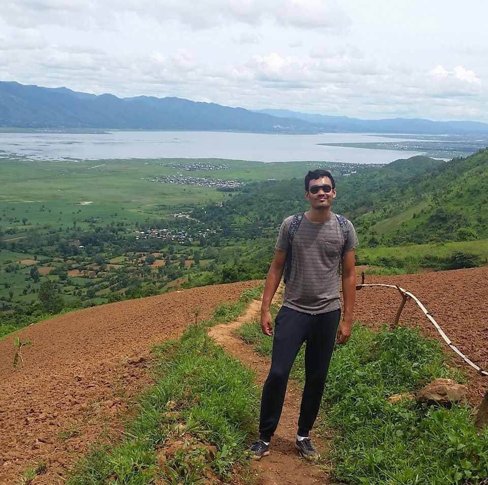

```{r setup, include=FALSE}
knitr::opts_chunk$set(echo = TRUE)
```

# Introduction

This homework is the first assignment from the 2019 UNIGE Summer School Course 'R-Programming for Data Science'.

# Video Presentation
<iframe width='400' height='300' src='https://www.youtube.com/embed/WpE_xMRiCLE' frameborder='0' allowfullscreen></iframe>

# Team Members

## Kieran Schubert

Kieran is a student in the MSc. Statistics at the University of Geneva and currently
enjoying this summer school course! 

My favorite hobby is cycling and I used to study Chemistry.

My favorite quote:

> Food is great! @kieran_quote

Courses Followed this year:

Courses followed | Time
---|---
Time Series | 08:00 - 10:00
Machine Learning | 10:00 - 12:00
Data Mining | 08:00 - 12:00

{width=250px, height=200px}

## Ozlem Queiros

Ozlem is a student in the MSc. Business Analytics at the University of Geneva and have a beautiful son:)
My favorite hobby is Zumba.


My favorite quote:

> Life is good! @Ozlem_quote

Courses Followed this year:

Courses followed | Time
---|---
Prescriptive Analytics | 10:00 - 12:00
Machine Learning | 10:00 - 12:00
Web Data And Analytics | 08:00 - 12:00

# R Markdown Syntax

```{r cache=T, fig.cap=T}
x <- rnorm(100)
mean(x)
median(x)
var(x)
hist(x)
```


# References